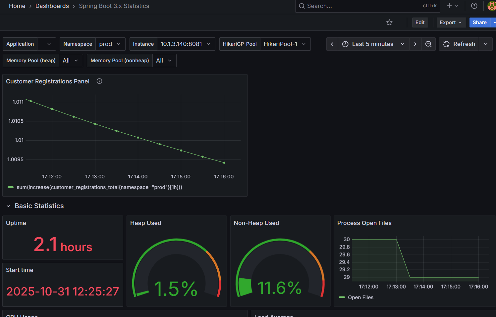

# Bank Microservices Project

This project is composed of multiple microservices using the Netflix stack (~~Eureka~~, Feign, Resilience4j) with Spring Boot, Kafka and Maven.
## Jenkins + Docker + Kubernetes + Helm
The project automates the CI/CD process for banking microservices. It performs:
- code build and testing;
- Docker image building;
- publishing images to GitHub Container Registry (GHCR);
- deployment to a Kubernetes cluster using Helm.

All stages are executed through Jenkins Pipeline.

## Prerequisites
To run the project, you will need add such entries to your `/etc/hosts` file
```/etc/hosts
127.0.0.1 customer.prod.local
127.0.0.1 fraud.prod.local
127.0.0.1 notification.prod.local
127.0.0.1 front-ui.prod.local
127.0.0.1 keycloak.prod.local
127.0.0.1 apigw.prod.local
127.0.0.1 exchange.prod.local
127.0.0.1 exchange-generator.prod.local
127.0.0.1 cash.prod.local
127.0.0.1 transfer.prod.local
```

## Spring Profiles
The project supports two Spring profiles:

- **default**
  used for local development, where Keycloak and each DB can be run as Docker containers (Docker Compose) and all the core microservices directly via Maven.
- **kube**
  Used for Docker Desktop Kubernetes cluster. This profile contains Kubernetes-specific configuration parameters for service endpoints, Keycloak issuer URLs, database connections, etc.
  Pods in Kubernetes do not automatically resolve *.prod.local domains to the ingress controller unless you explicitly configure /etc/hosts mapping inside pods using hostAliases. You must set hostAliases in deployment.yaml >> Replace 10.1.0.88 with the current IP of your ingress controller (check via kubectl get pod -n ingress-nginx -o wide).

You can switch profiles by setting the SPRING_PROFILES_ACTIVE environment variable.

## Modules

- **Customer**  
  Handles customer registration and account management. It uses Resilience4j circuit breaker and retry functionalities. The service communicates with the Fraud service using Feign clients.

- **Fraud**  
  Provides endpoints to check if a customer is fraudulent. It stores fraud check history and uses a service to determine fraud status.

- **Exchange**  
  Manages currency exchange rates for the banking system. Provides real-time currency rates relative to RUB (base currency). It consumes rate updates from a Kafka topic, which are sent by the Exchange Generator service. Supports RUB, USD, and CNY currencies. The service stores exchange rates in PostgreSQL.

- **Exchange Generator**  
  A separate service that provides exchange rates for RUB, USD, and CNY. It sends rate updates to a Kafka topic every 5 seconds. It uses a JSON file with exchange rates as a data source (using a Round Robin strategy for rate selection).

- **Clients**  
  Contains shared Feign clients and response object definitions used for inter-service communication.

- **Notification**  
  Handles sending notifications to customers. It uses a PostgreSQL database for persistence. The service receives notification requests from other microservices asynchronously via Kafka.

- **API Gateway**  
  Routes incoming requests to the appropriate microservices. It is built using Spring Cloud Gateway and provides load balancing, routing, and fallback capabilities. The gateway uses filters to handle cross-cutting concerns like error handling and circuit breaking.

- **FRONT UI**  
  Provides a web user interface using Thymeleaf. The service runs on port `8085` and integrates with other microservices via Feign clients. It exposes endpoints such as `/` for the landing page (redirecting to `/main`) and `/main?login={login}` to render the main page with dynamic user data. The UI automatically updates exchange rates every second using JavaScript.
 
- **Cash**
  Handles cash-in (deposit) and cash-out (withdraw) operations on user accounts.

- **Transfer**
  Handles money transfers between customers accounts.


## Technologies

- Spring Boot
- Spring Cloud OpenFeign, Load Balancer
- Resilience4j (Circuit breaker and Retry)
- Docker Desktop (with k8s), Docker Compose
- Jenkins
- Helm
- Kafka
- PostgreSQL (database per service)
- Testcontainers
- Maven
- Keycloak (Authorization & Authentication)
- Zipkin (Distributed Tracing)
- Prometheus (Metrics Collection)
- Grafana (Metrics Visualization)
- Micrometer (Application Metrics)

## Distributed Tracing with Zipkin

The project uses Zipkin for distributed tracing to monitor and troubleshoot microservices-based architecture. All services are configured to send tracing data to a Zipkin server.

- **Micrometer Tracing with Brave:** The application uses Micrometer Tracing with the Brave tracer implementation to instrument the code for tracing.
- **Zipkin Reporter:** The `zipkin-reporter-brave` dependency sends the collected traces to the Zipkin server.
- **Trace Propagation:** Traces are propagated across service boundaries, allowing to visualize the full lifecycle of a request.
- **Zipkin UI:** The Zipkin UI can be used to view the traces and analyze the latency of the requests.

## Monitoring & Observability

The project uses Prometheus Stack for comprehensive monitoring and alerting of all microservices.

### Prometheus Stack Components

- **Prometheus** - Metrics collection and storage with PromQL query language
- **Grafana** - Metrics visualization with pre-configured dashboards
- **Alertmanager** - Alert routing and management
- **Node Exporter** - Hardware and OS metrics
- **Kube State Metrics** - Kubernetes cluster state metrics

### Custom Application Metrics

All microservices expose custom Micrometer metrics via `/actuator/prometheus` endpoint:

- **customer-service:**
  - `customer_registrations_total` (Counter) - Total number of user registrations
  - `customer_logins_total{result}` (Counter) - Login attempts (success/failed)

- **fraud-service:**
  - `fraud_checks_total{result}` (Counter) - Fraud check operations (pass/fail)

- **exchange-service:**
  - `exchange_rates_last_update_timestamp_seconds` (Gauge) - Timestamp of last exchange rate update

- **transfer-service:**
  - `transfers_total{result}` (Counter) - Money transfer operations (success/fail)

- **cash-service:**
  - `cash_operations_total{action,result}` (Counter) - Cash operations (deposit/withdraw, success/fail)

### Prometheus Alerts

The system includes pre-configured alerts for critical scenarios:

- **LowFraudCheckRate** (Warning)
  - Triggers when fraud check rate drops below 1/sec for 2 minutes
  - Indicates possible integration issues with fraud service

- **LowUserRegistrationRate** (Warning)
  - Triggers when less than 1 user registers per hour
  - May indicate problems with customer service or UI

- **ExchangeRatesNotUpdating** (Critical)
  - Triggers when exchange rates haven't been updated for more than 30 seconds
  - Indicates issues with exchange-generator-service, Kafka, or exchange-service consumer

### Accessing Monitoring Tools

After successful deployment to Kubernetes, access Prometheus and Grafana using port-forwarding:

```bash
# Prometheus UI (metrics, alerts, targets)
kubectl port-forward -n monitoring svc/prometheus-stack-kube-prom-prometheus 9090:9090

# Grafana UI (dashboards, visualizations)
kubectl port-forward -n monitoring svc/prometheus-stack-grafana 3000:80
```

**Access URLs:**
- Prometheus: http://localhost:9090
- Grafana: http://localhost:3000 (credentials: admin/admin)

**Useful Prometheus queries:**
- `up` - Check service health
- `rate(fraud_checks_total[5m])` - Fraud check rate
- `time() - exchange_rates_last_update_timestamp_seconds` - Seconds since last exchange rate update

## Security & Authentication

- **Keycloak** (OIDC, port 8090 (if not k8s), realm: `bank-realm`) provides authentication and JWT tokens.
- **Front-UI** uses Authorization Code Flow with Keycloak.
- **API Gateway** and all backend microservices (Customer, Exchange, Notification, Fraud, Cash, Transfer) are set as resource servers and validate Keycloak JWT tokens.
- Service-to-service calls use confidential Keycloak clients (service accounts) for authentication.
- On login, user is redirected to Keycloak, receives JWT (proxied by Gateway), and all service calls are authorized. On logout, SSO session is ended via Keycloak.
- **Just-In-Time Provisioning:** on first login, Front-UI syncs profile with Customer service.

## Service Endpoints

### API Gateway

- All requests pass through the API Gateway on apigw.prod.local (k8s) / localhost:8080 (local)`.
- **Example:**  
  - **GET** `/api/v1/customers/public`  
    Routes the request to the Customer service.
  - **GET** `/api/rates`  
    Routes the request to the Exchange service for currency rates.

### Customer Microservice

- **POST** `/api/v1/customers/signup`  
  Registers a new customer using a JSON body with fields: `login`, `password`, `confirmPassword`, `name`, `email`, and `birthdate`.

- **GET** `/api/v1/customers/public`  
  Public endpoint to verify service availability.

- **GET** `/api/v1/customers/main?login={login}`  
  Retrieves main page data for a specific user including account information, available currencies, and user lists.

- **POST** `/api/v1/customers/user/{login}/editPassword`  
  Changes user password. Accepts JSON body with `password` and `confirmPassword` fields.

- **POST** `/api/v1/customers/user/{login}/editUserAccounts`  
  Updates user profile and account settings. Accepts JSON body with `name`, `birthdate`, and `accounts` fields.

### Exchange Microservice

- **GET** `/api/rates`  
  Retrieves current currency exchange rates. Returns a JSON array with exchange rate information for all supported currencies (RUB, USD, CNY).

### Fraud Microservice

- **GET** `/api/v1/fraud-check/{customerId}`  
  Checks if the customer with the provided \`customerId\` is fraudulent. Stores the fraud check history.

### Notification Microservice

- **POST** `/api/v1/notifications`  
  Sends a notification to a customer.
- The service is configured to run on port \`8083\` and uses PostgreSQL for data storage.

### Clients Module

- Provides Feign clients for inter-service communication such as contacting the Fraud, Notification, and Exchange services.

### FRONT UI Microservice

- **GET** `/`  
  Redirects to the main page.
  
- **GET** `/main?login={login}`  
  Renders the main page using Thymeleaf and loads dynamic user data for the specified user. Automatically fetches and displays current exchange rates.

- **GET** `/signup`  
  Displays the customer registration form.

- **POST** `/signup`  
  Registers a new customer. Accepts form data with `login`, `password`, `confirm_password`, `name`, `email`, and `birthdate` fields.

- **POST** `/user/{login}/editPassword`  
  Processes password change form submission. Accepts form data with `password` and `confirm_password` fields.

- **POST** `/user/{login}/editUserAccounts`  
  Processes user account update form submission. Accepts form data with `name`, `birthdate`, and `accounts` fields.

- **POST** `/user/{login}/cash` — send cash-in/cash-out request (form invokes Cash service via Backend). Form accepts 'PUT'/'GET' as an action
- **POST** `/user/{login}/cash`
  - **JSON body:**
    ```json
    {
      "login": "john",
      "currency": "RUB",
      "value": 1000.00,
      "action": "PUT"
    }
    ```
  - **Valid values for `action`:** `"PUT"` or `"GET"`. (only form FRONT-UI)
  
### Cash Microservice

- **POST** `/api/v1/cash/operation`
  - **JSON body:**
    ```json
    {
      "login": "john",
      "currency": "RUB",
      "value": 1000.00,
      "action": "DEPOSIT"
    }
    ```
  - **Valid values for `action`:** `"DEPOSIT"` or `"WITHDRAW"`.
  - **Response:**
    ```json
    {
      "success": true,
      "errors": []
    }
    ```
    - **Example of insufficient funds response:**
    ```json
    {
      "success": false,
      "errors": ["Insufficient funds. Available: 20.00 RUB"]
    }
    ```
### Transfer Microservice

- **POST** `/user/{login}/transfer`  
  Transfers money between accounts. Supports transfers within same user accounts or to different users with automatic currency conversion.
  - **JSON body:**
    ```
    {
      "fromCurrency": "USD",
      "toCurrency": "RUB", 
      "value": 100.00,
      "toLogin": "recipient_user"
    }
    ```
  - **Response:**
    ```
    {
      "success": true,
      "transferErrors": [],
      "transferOtherErrors": []
    }
    ```
  - **Currency conversion examples:**
    - Same currency (RUB → RUB): No conversion, direct transfer
    - Different currencies (USD → RUB): Automatic conversion using Exchange service rates
    - Cross-currency (USD → CNY): Conversion through RUB as base currency

- **Example transfer scenarios:**
  - **Same currency transfer:** 100 RUB → 100 RUB (no Exchange service call)
  - **Currency conversion:** 10 USD → 950 RUB (using rate USD=95.0)
  - **Cross-currency:** 10 USD → 70.37 CNY (USD→RUB→CNY conversion)


## Architecture Overview

The system consists of the following microservices running on different ports (database per service is PostgreSQL):

- **Customer**: - User management and accounts
- **Fraud**: - Fraud detection
- **Notification**: - Notification handling  
- **API Gateway**: - Request routing and load balancing
- **Front UI**: - Web user interface
- **Exchange**: - Currency exchange rates management
- **Exchange Generator**: - Automatic exchange rate generation
- **Cash**: withdrawal and deposit operations
- **Transfer**: - Money transfers with currency conversion

## Running the Project locally
1. .env >> прописать свои значения для postgres (в докере если локально запускать)
2. ```docker-compose up -d```.
   - **Note:** Ensure that the Keycloak server is running on port `8090` and the realm is named `bank-realm`.
   - The Keycloak server will be used for authentication and authorization.
   - Insure that Kafka is up and running `localhost:9092`. Kafka UI on `localhost:7080`

3. Build the project:
   ```bash
   mvn clean install
    ```
4. Run the services (using 'default' Spring Profile):
   ```bash
   mvn spring-boot:run
    ```
5. Register new customer `http://localhost:8080/signup`.
6. Access the application (api-gateway) at `http://localhost:8080`. After successful login redirect to http://localhost:8080/main
7. Access Kafka UI on `localhost:7080`
7. Do logout (via `http://localhost:8080/logout` and create one more customer (to test transferring money between them).

## Running the Project in Kubernetes
1. Ensure you have a running Kubernetes cluster (e.g., Docker Desktop with Kubernetes enabled).
2. Install Helm if you haven't already.
3. Run jenkins (via docker-compose up -d --build in jenkins folder).
4. Open Jenkins at `http://localhost:8080` and trigger the `YandexHelmApp` job to deploy the application to your Kubernetes cluster.
5. Wait for the job to complete successfully. There is a manual approval step before deploying to production.
6. Make sure that keycloak is running in the cluster and accessible at `http://keycloak.prod.local`.
5. Access the application via the configured domain names (`http://apigw.prod.local/signup`).
6. After successful login redirect to http://apigw.prod.local/main
7. Access monitoring tools using port-forwarding:
   ```bash
   # Prometheus UI
   kubectl port-forward -n monitoring svc/prometheus-stack-kube-prom-prometheus 9090:9090

   # Grafana UI
   kubectl port-forward -n monitoring svc/prometheus-stack-grafana 3000:80
   ```
   - Prometheus: http://localhost:9090
   - Grafana: http://localhost:3000 (credentials: admin/admin)

## Usage Examples

### Register a new customer (for k8s)
```bash
POST http://apigw.prod.local/signup
Content-Type: application/json

{
  "login": "john",
  "password": "securePassword123",
  "confirmPassword": "securePassword123", 
  "name": "John Doe",
  "email": "jdoe2@gmail.com",
  "birthdate": "1995-03-15"
}
```

### Change user password
```bash
POST http://apigw.prod.local/api/v1/customers/user/john/editPassword
Content-Type: application/json

{
  "password": "newPassword123",
  "confirmPassword": "newPassword123"
}
```

### Change user profile and accounts
```bash
POST http://apigw.prod.local/api/v1/customers/user/john/editUserAccounts
Content-Type: application/json

{
  "name" : "John Doe",
  "birthdate": "1995-03-15",
  "accounts": [
    "RUB",
    "USD"
  ]
}
```

### Get current exchange rates
```bash
GET http://apigw.prod.local/api/rates
Accept: application/json
```

**Response:**
```json
[
  {
    "title": "Рубль",
    "name": "RUB", 
    "value": 1.0
  },
  {
    "title": "Доллар",
    "name": "USD",
    "value": 93.50
  },
  {
    "title": "Юань", 
    "name": "CNY",
    "value": 13.20
  }
]
```

### Update exchange rates

Exchange rates are updated automatically via Kafka. The `exchange-generator-service` produces new rates to a Kafka topic, and the `exchange-service` consumes them. This process happens automatically and does not require manual intervention.

### DEPOSIT cash operation:
```http
POST http://localhost:8088/api/v1/cash/operation
Content-Type: application/json

{
  "login": "john",
  "currency": "RUB",
  "value": 500.00,
  "action": "DEPOSIT"
}
```

### WITHDRAW cash:
```http
POST http://localhost:8088/api/v1/cash/operation
Content-Type: application/json

{
  "login": "john",
  "currency": "USD",
  "value": 20.00,
  "action": "WITHDRAW"
}
```
**Insufficient funds:**
```json
{
  "success": false,
  "errors": ["Insufficient funds. Available: 15.00 USD"]
}
```

### using Front-UI:
В браузере — форма отправляет POST `/user/{login}/cash`, параметры: currency, value, action ("DEPOSIT"/"WITHDRAW"). Front-UI вызывает Cash сервис, результат и ошибки отображаются на /main.

## Grafana Dashboards

After deploying the monitoring stack, you can visualize metrics using Grafana dashboards.

### Accessing Grafana

1. Port-forward to Grafana service:
   ```bash
   kubectl port-forward -n monitoring svc/prometheus-stack-grafana 3000:80
   ```

2. Open http://localhost:3000 in your browser

3. Login with credentials:
   - Username: `admin`
   - Password: `admin`

### Pre-configured Dashboard: Spring Boot 3.x Statistics

The project includes comprehensive Spring Boot metrics for all microservices. Import the official Spring Boot dashboard:

1. In Grafana UI, navigate to: **☰ (left menu) → Dashboards → Import**
2. Enter Dashboard ID: **19004**
3. Click **Load**
4. Select Prometheus datasource: **Prometheus** (auto-configured)
5. Click **Import**

**Viewing Service Metrics:**
1. Open the **Spring Boot 3.x Statistics** dashboard
2. Select variables:
   - `namespace`: **prod**
   - `instance`: Choose a service (e.g., `customer-service`, `fraud-service`, `exchange-service`)
3. View available metrics:
   - HTTP Statistics (RPS, response times, status codes)
   - JVM Memory (heap, non-heap, metaspace)
   - Garbage Collection Statistics
   - Thread Statistics
   - Tomcat Statistics

**Note:** Graphs may be empty for the first 1-2 minutes while metrics accumulate.

### Custom Dashboard: Exchange Rates Freshness

Create a custom panel to monitor exchange rate update freshness:

1. In Grafana, navigate to: **☰ → Dashboards → New → New Dashboard**
2. Click **Add visualization**
3. Select **Prometheus** as data source
4. Configure the panel:
   - **Title:** Exchange Rates Freshness
   - **PromQL Query:**
     ```promql
     time() - exchange_rates_last_update_timestamp_seconds
     ```
   - **Legend:** `Seconds since last update`
   - **Unit:** `seconds (s)`
   - **Visualization:** Time series (line chart)
   - **Graph styles:**
     - Line interpolation: Linear
     - Fill opacity: 10
     - Stacking: Normal
   - **Legend placement:** Bottom
   - **Tooltip mode:** All series

5. Add threshold (optional):
   - Click **Add threshold**
   - Value: `30` (seconds)
   - Color: Red
   - This highlights when updates are delayed beyond the alert threshold

6. Click **Apply** and **Save dashboard**

**Interpreting the Graph:**
- **Normal operation:** Line stays near 0-5 seconds (exchange-generator publishes every 5s)
- **Warning:** Line exceeds 30 seconds (triggers `ExchangeRatesNotUpdating` alert)
- **Critical issue:** Line continuously increases (Kafka or exchange-service consumer is down)

### Custom Dashboard: Customer Registrations

Create a panel to monitor user registration activity:

1. In Grafana, navigate to: **☰ → Dashboards → New → New Dashboard** (or add to existing dashboard)
2. Click **Add visualization**
3. Select **Prometheus** as data source
4. Configure the panel:
   - **Title:** Customer Registrations
   - **PromQL Query:**
     ```promql
     sum(increase(customer_registrations_total{namespace="prod"}[1h]))
     ```
   - **Legend:** `Registrations per hour`
   - **Unit:** `short` (or `registrations` if you want custom unit)
   - **Visualization:** Choose one:
     - **Stat panel** - Shows current value as large number (good for single metric display)
     - **Time series** - Shows trend over time (good for historical analysis)

5. **For Stat panel:**
   - **Graph mode:** None
   - **Text mode:** Value and name
   - **Color mode:** Value
   - **Orientation:** Auto

6. **For Time series panel:**
   - **Graph styles:**
     - Line interpolation: Linear
     - Fill opacity: 20
     - Line width: 2
   - **Legend placement:** Bottom

7. Add threshold (optional):
   - Click **Add threshold**
   - Value: `1` (minimum expected registrations per hour)
   - Color: Red (below threshold) / Green (above threshold)
   - This helps identify periods with low registration activity

8. Click **Apply** and **Save dashboard**

**Interpreting the Metric:**
- **Healthy system:** Regular registrations throughout the day
- **Warning:** Less than 1 registration per hour (triggers `LowUserRegistrationRate` alert)
- **Investigation needed:** Sudden drop to zero (possible issues with customer-service or front-ui)

### Other Useful Custom Panels

**Fraud Check Rate:**
```promql
rate(fraud_checks_total[5m])
```

**User Registration Rate:**
```promql
rate(customer_registrations_total[1h])
```

**Successful vs Failed Transfers:**
```promql
rate(transfers_total{result="success"}[5m])
rate(transfers_total{result="fail"}[5m])
```

**Cash Operations by Action:**
```promql
rate(cash_operations_total{action="deposit"}[5m])
rate(cash_operations_total{action="withdraw"}[5m])
```

### Viewing Alerts in Grafana

1. Navigate to: **☰ → Alerting → Alert rules**
2. You should see alerts from Prometheus:
   - `LowFraudCheckRate` (Warning)
   - `LowUserRegistrationRate` (Warning)
   - `ExchangeRatesNotUpdating` (Critical)

3. To view active alerts, go to: **☰ → Alerting → Firing**
